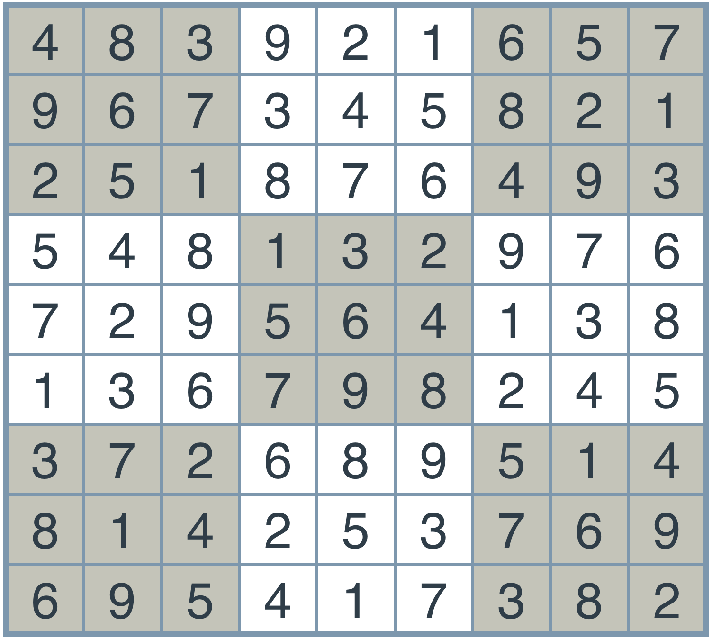

# Solve Sudoku with AI

## 1.Introduction
In this blog we will concentrate on two main concepts, constraint propagation and search. To learn these concepts, we will build an AI agent that will solve any sudoku puzzle. As you know sudoku puzzle consists of 9 x 9 square with each row, column and 3 x 3 subsquares containing the numbers from 1 to 9 appearing exactly once. Here is an example of suduku puzzle and the corresponding solution. 


We will build an agent with python that will solve any sudoku. It is abased on Peter Norvig [[blog]](http://norvig.com/sudoku.html), 

## 2.Solving a sudoku
### What is a Sudoku?
[Sudoku](https://en.wikipedia.org/wiki/Sudoku) is one of the world's most popular puzzles. It consists of a 9x9 grid, and the objective is to fill the grid with digits in such a way that each row, each column, and each of the 9 principal 3x3 subsquares contains all of the digits from 1 to 9. The detailed rules can be found, for example, [here](http://www.conceptispuzzles.com/?uri=puzzle/sudoku/rules). The puzzle is given as a partially completed grid, and the goal is to fill in the missing numbers. Below is an example of such a grid.


### Goals of this project
The main goal of this project is to build an intelligent agent that will solve every sudoku while introducing you to two powerful techniques that are used throughout the field of AI:

#### 1 Constraint Propagation
When trying to solve a problem, you'll find that there are some local constraints to each square. These constraints help you narrow the possibilities for the answer, which can be very helpful. We will learn to extract the maximum information out of these constraints in order to get closer to our solution. Additionally, you'll see how we can repeatedly apply simple constraints to iteratively narrow the search space of possible solutions. Constraint propagation can be used to solve a variety of problems such as calendar scheduling, and cryptographic puzzles.
#### 2 Search
In the process of problem solving, we may get to the point where two or more possibilities are available. What do we do? What if we branch out and consider both of them? Maybe one of them will lead us to a position in which three or more possibilities are available. Then, we can branch out again. At the end, we can create a whole tree of possibilities and find ways to traverse the tree until we find our solution. This is an example of how search can be used.
These ideas may seem simple and they're actually intended to be! Through this lesson you'll see how AI is really composed of very simple ideas that can be put together to solve complex problems. Throughout this lesson, we challenge you to think of how you can apply these ideas to build AI agents to solve other puzzles and problems in your world!

## 3. Setting up the Board
### Sudoku: Solution
The solution of sudoku should follow the following rules:

* If a box has a value, then all the boxes in the same row, same column, or same 3x3 square cannot have that same value.
* If there is only one allowed value for a given box in a row, column, or 3x3 square, then the box is assigned that value.

The puzzle is given as a partially completed grid, and the goal is to fill in the missing numbers. Below is an example of such a grid.



### Naming Conventions
#### Rows and Columns
Since we're writing an agent to solve the Sudoku puzzle, let's start by labelling rows and columns.

* The rows will be labelled by the letters A, B, C, D, E, F, G, H, I.
* The columns will be labelled by the numbers 1, 2, 3, 4, 5, 6, 7, 8, 9. Here we can see the unsolved and solved puzzles with the labels for the rows and columns.
* The 3x3 squares won't be labelled, but in the diagram, they can be seen with alternating colors of grey and white.

#### Boxes, Units and Peers
And let's start naming the important elements created by these rows and columns that are relevant to solving a Sudoku:

* The individual squares at the intersection of rows and columns will be called `boxes`. These boxes will have labels 'A1', 'A2', ..., 'I9'.
* The complete rows, columns, and 3x3 squares, will be called `units`. Thus, each unit is a set of 9 boxes, and there are 27 units in total.
* For a particular box (such as 'A1'), its `peers` will be all other boxes that belong to a common unit (namely, those that belong to the same row, column, or 3x3 square).

Let's see an example. In the grids below, the set of highlighted boxes represent units. Each grid shows a different peer of the box at E3.


Let's test your understanding! For any box, how many peers are there?
Answer (20)

## 4.Encoding the Board
Now, in order to implement an agent, let's start by coding the board in Python. Then, we'll code the necessary functions to solve the Sudoku. We'll record the puzzles in two ways — as a `string` and as a `dictionary`.
The string will consist of a concatenation of all the readings of the digits in the rows, taking the rows from top to bottom. If the puzzle is not solved, we can use a `.` as a placeholder for an empty box.

For example, the unsolved puzzle at the above left will be written as: `..3.2.6..9..3.5..1..18.64....81.29..7.......8..67.82....26.95..8..2.3..9..5.1.3..`

And the solved puzzle at the above right, will be recorded as:
`483921657967345821251876493548132976729564138136798245372689514814253769695417382`

We'll implement the dictionary as follows. The keys will be strings corresponding to the boxes — namely, `'A1'`, `'A2'`, ..., `'I9'`. The values will either be the digit in each box (if there is one) or a `'.'` (if not).

So, let's get started. First, we'll record rows and columns as strings.
```python
rows = 'ABCDEFGHI'
cols = '123456789'
```
We'll start by writing a helper function, `cross(a, b)`, which, given two strings — `a `and `b` — will return the list formed by all the possible concatenations of a letter `s` in string `a` with a letter `t` in string `b`.

So `cross('abc', 'def')` will return `['ad', 'ae', 'af', 'bd', 'be', 'bf', 'cd', 'ce', 'cf']`.
```python
def cross(a, b):
      return [s+t for s in a for t in b]
```
Now, to create the labels of the boxes:
```python
boxes = cross(rows, cols)
boxes =
    ['A1', 'A2', 'A3', 'A4', 'A5', 'A6', 'A7', 'A8', 'A9',
     'B1', 'B2', 'B3', 'B4', 'B5', 'B6', 'B7', 'B8', 'B9',
     'C1', 'C2', 'C3', 'C4', 'C5', 'C6', 'C7', 'C8', 'C9',
     'D1', 'D2', 'D3', 'D4', 'D5', 'D6', 'D7', 'D8', 'D9',
     'E1', 'E2', 'E3', 'E4', 'E5', 'E6', 'E7', 'E8', 'E9',
     'F1', 'F2', 'F3', 'F4', 'F5', 'F6', 'F7', 'F8', 'F9',
     'G1', 'G2', 'G3', 'G4', 'G5', 'G6', 'G7', 'G8', 'G9',
     'H1', 'H2', 'H3', 'H4', 'H5', 'H6', 'H7', 'H8', 'H9',
     'I1', 'I2', 'I3', 'I4', 'I5', 'I6', 'I7', 'I8', 'I9']
```
And for the units:
```python
row_units = [cross(r, cols) for r in rows]
# Element example:
# row_units[0] = ['A1', 'A2', 'A3', 'A4', 'A5', 'A6', 'A7', 'A8', 'A9']
# This is the top most row.

column_units = [cross(rows, c) for c in cols]
# Element example:
# column_units[0] = ['A1', 'B1', 'C1', 'D1', 'E1', 'F1', 'G1', 'H1', 'I1']
# This is the left most column.

square_units = [cross(rs, cs) for rs in ('ABC','DEF','GHI') for cs in ('123','456','789')]
# Element example:
# square_units[0] = ['A1', 'A2', 'A3', 'B1', 'B2', 'B3', 'C1', 'C2', 'C3']
# This is the top left square.

unitlist = row_units + column_units + square_units
```
Now, we're ready to turn the string representation of a sudoku into a dictionary representation. That'll be your turn to shine!

### Exercise: Implement `grid_values()`
A function to convert the string representation of a puzzle into a dictionary form.
Recall that for the string:

```
'..3.2.6..9..3.5..1..18.64....81.29..7.......8..67.82....26.95..8..2.3..9..5.1.3..'
```
..we'd like to return the dictionary:
```python
{
  'A1': '.'
  'A2': '.',
  'A3': '3',
  'A4': '.',
  'A5': '2',
  ...
  'I9': '.'
}
```
Implement a function called `grid_values()` that performs this task.

Following is an example of what you should see when you implement this function correctly. The `display()` function shows a nice visual representation of the dictionary, and has been provided in utils.py.

```
>>> from utils import display
>>> display(grid_values('..3.2.6..9..3.5..1..18.64....81.29..7.......8..67.82....26.95..8..2.3..9..5.1.3..'))
. . 3 |. 2 . |6 . . 
9 . . |3 . 5 |. . 1 
. . 1 |8 . 6 |4 . . 
------+------+------
. . 8 |1 . 2 |9 . . 
7 . . |. . . |. . 8 
. . 6 |7 . 8 |2 . . 
------+------+------
. . 2 |6 . 9 |5 . . 
8 . . |2 . 3 |. . 9 
. . 5 |. 1 . |3 . . 
```
#### Note:

* All your code should go in `function.py`.
* You can use the helper functions and variables defined in `utils.py`.

### Exercise Solution
```python
from utils import *

def grid_values(grid):
    """Convert grid string into {<box>: <value>} dict with '.' value for empties.

    Args:
        grid: Sudoku grid in string form, 81 characters long
    Returns:
        Sudoku grid in dictionary form:
        - keys: Box labels, e.g. 'A1'
        - values: Value in corresponding box, e.g. '8', or '.' if it is empty.
    """
    assert len(grid) == 81, "Input grid must be a string of length 81 (9x9)"
    return dict(zip(boxes, grid))
```
## References
Peter Norvig, Solve every sudoku puzzle [[blog]](http://norvig.com/sudoku.html)
