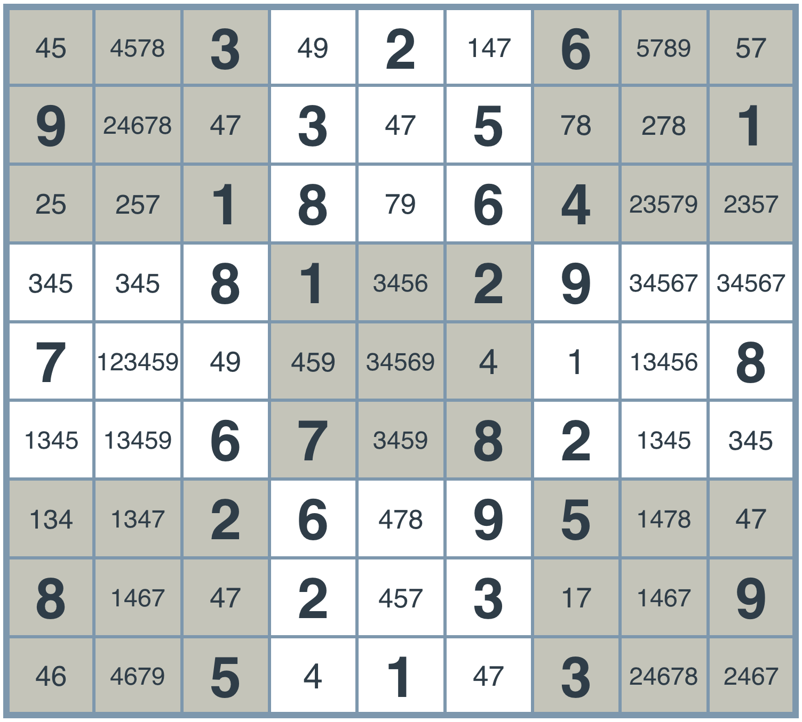
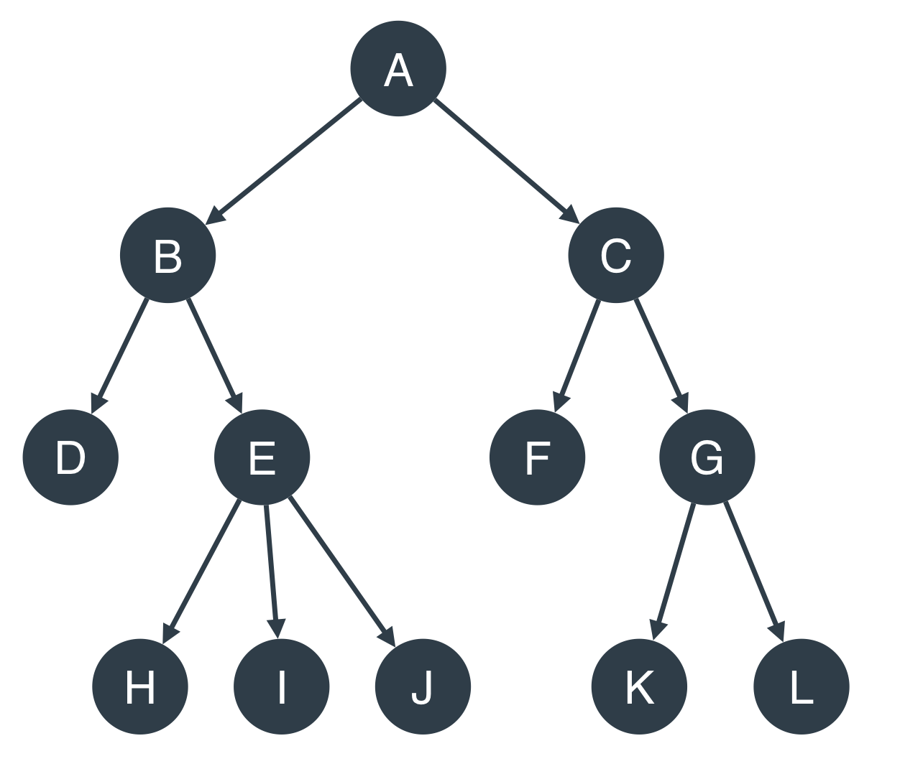

# An AI Agent to Solve Any Sudoku Puzzle
_Source: Udacity AI Nanodegree - Build a Sudoku Solver Project_
_Reorganized by: Osama Hosameldeen_

## 1.Introduction
In this blog we will concentrate on two main concepts, constraint propagation and search. To learn these concepts, we will build an AI agent that will solve any sudoku puzzle. As you know sudoku puzzle consists of 9 x 9 square with each row, column and 3 x 3 subsquares containing the numbers from 1 to 9 appearing exactly once. Here is an example of suduku puzzle and the corresponding solution. 


We will build an agent with python that will solve any sudoku. It is abased on Peter Norvig [[blog]](http://norvig.com/sudoku.html), 

## 2.Solving a sudoku
### What is a Sudoku?
[Sudoku](https://en.wikipedia.org/wiki/Sudoku) is one of the world's most popular puzzles. It consists of a 9x9 grid, and the objective is to fill the grid with digits in such a way that each row, each column, and each of the 9 principal 3x3 subsquares contains all of the digits from 1 to 9. The detailed rules can be found, for example, [here](http://www.conceptispuzzles.com/?uri=puzzle/sudoku/rules). The puzzle is given as a partially completed grid, and the goal is to fill in the missing numbers. Below is an example of such a grid.


### Goals of this project
The main goal of this project is to build an intelligent agent that will solve every sudoku while introducing you to two powerful techniques that are used throughout the field of AI:

#### 1 Constraint Propagation
When trying to solve a problem, you'll find that there are some local constraints to each square. These constraints help you narrow the possibilities for the answer, which can be very helpful. We will learn to extract the maximum information out of these constraints in order to get closer to our solution. Additionally, you'll see how we can repeatedly apply simple constraints to iteratively narrow the search space of possible solutions. Constraint propagation can be used to solve a variety of problems such as calendar scheduling, and cryptographic puzzles.
#### 2 Search
In the process of problem solving, we may get to the point where two or more possibilities are available. What do we do? What if we branch out and consider both of them? Maybe one of them will lead us to a position in which three or more possibilities are available. Then, we can branch out again. At the end, we can create a whole tree of possibilities and find ways to traverse the tree until we find our solution. This is an example of how search can be used.
These ideas may seem simple and they're actually intended to be! Through this lesson you'll see how AI is really composed of very simple ideas that can be put together to solve complex problems. Throughout this lesson, we challenge you to think of how you can apply these ideas to build AI agents to solve other puzzles and problems in your world!

## 3. Setting up the Board
### Sudoku: Solution
The solution of sudoku should follow the following rules:

* If a box has a value, then all the boxes in the same row, same column, or same 3x3 square cannot have that same value.
* If there is only one allowed value for a given box in a row, column, or 3x3 square, then the box is assigned that value.

The puzzle is given as a partially completed grid, and the goal is to fill in the missing numbers. Below is an example of such a grid.


### Naming Conventions
#### Rows and Columns
Since we're writing an agent to solve the Sudoku puzzle, let's start by labelling rows and columns.

* The rows will be labelled by the letters A, B, C, D, E, F, G, H, I.
* The columns will be labelled by the numbers 1, 2, 3, 4, 5, 6, 7, 8, 9. Here we can see the unsolved and solved puzzles with the labels for the rows and columns.
* The 3x3 squares won't be labelled, but in the diagram, they can be seen with alternating colors of grey and white.

#### Boxes, Units and Peers
And let's start naming the important elements created by these rows and columns that are relevant to solving a Sudoku:

* The individual squares at the intersection of rows and columns will be called `boxes`. These boxes will have labels 'A1', 'A2', ..., 'I9'.
* The complete rows, columns, and 3x3 squares, will be called `units`. Thus, each unit is a set of 9 boxes, and there are 27 units in total.
* For a particular box (such as 'A1'), its `peers` will be all other boxes that belong to a common unit (namely, those that belong to the same row, column, or 3x3 square).

Let's see an example. In the grids below, the set of highlighted boxes represent units. Each grid shows a different peer of the box at E3.


Let's test your understanding! For any box, how many peers are there?
Answer (20)

## 4.Encoding the Board
Now, in order to implement an agent, let's start by coding the board in Python. Then, we'll code the necessary functions to solve the Sudoku. We'll record the puzzles in two ways — as a `string` and as a `dictionary`.
The string will consist of a concatenation of all the readings of the digits in the rows, taking the rows from top to bottom. If the puzzle is not solved, we can use a `.` as a placeholder for an empty box.

For example, the unsolved puzzle at the above left will be written as: `..3.2.6..9..3.5..1..18.64....81.29..7.......8..67.82....26.95..8..2.3..9..5.1.3..`

And the solved puzzle at the above right, will be recorded as:
`483921657967345821251876493548132976729564138136798245372689514814253769695417382`

We'll implement the dictionary as follows. The keys will be strings corresponding to the boxes — namely, `'A1'`, `'A2'`, ..., `'I9'`. The values will either be the digit in each box (if there is one) or a `'.'` (if not).

So, let's get started. First, we'll record rows and columns as strings.
```python
rows = 'ABCDEFGHI'
cols = '123456789'
```
We'll start by writing a helper function, `cross(a, b)`, which, given two strings — `a `and `b` — will return the list formed by all the possible concatenations of a letter `s` in string `a` with a letter `t` in string `b`.

So `cross('abc', 'def')` will return `['ad', 'ae', 'af', 'bd', 'be', 'bf', 'cd', 'ce', 'cf']`.
```python
def cross(a, b):
      return [s+t for s in a for t in b]
```
Now, to create the labels of the boxes:
```python
boxes = cross(rows, cols)
boxes =
    ['A1', 'A2', 'A3', 'A4', 'A5', 'A6', 'A7', 'A8', 'A9',
     'B1', 'B2', 'B3', 'B4', 'B5', 'B6', 'B7', 'B8', 'B9',
     'C1', 'C2', 'C3', 'C4', 'C5', 'C6', 'C7', 'C8', 'C9',
     'D1', 'D2', 'D3', 'D4', 'D5', 'D6', 'D7', 'D8', 'D9',
     'E1', 'E2', 'E3', 'E4', 'E5', 'E6', 'E7', 'E8', 'E9',
     'F1', 'F2', 'F3', 'F4', 'F5', 'F6', 'F7', 'F8', 'F9',
     'G1', 'G2', 'G3', 'G4', 'G5', 'G6', 'G7', 'G8', 'G9',
     'H1', 'H2', 'H3', 'H4', 'H5', 'H6', 'H7', 'H8', 'H9',
     'I1', 'I2', 'I3', 'I4', 'I5', 'I6', 'I7', 'I8', 'I9']
```
And for the units:
```python
row_units = [cross(r, cols) for r in rows]
# Element example:
# row_units[0] = ['A1', 'A2', 'A3', 'A4', 'A5', 'A6', 'A7', 'A8', 'A9']
# This is the top most row.

column_units = [cross(rows, c) for c in cols]
# Element example:
# column_units[0] = ['A1', 'B1', 'C1', 'D1', 'E1', 'F1', 'G1', 'H1', 'I1']
# This is the left most column.

square_units = [cross(rs, cs) for rs in ('ABC','DEF','GHI') for cs in ('123','456','789')]
# Element example:
# square_units[0] = ['A1', 'A2', 'A3', 'B1', 'B2', 'B3', 'C1', 'C2', 'C3']
# This is the top left square.

unitlist = row_units + column_units + square_units
```
Now, we're ready to turn the string representation of a sudoku into a dictionary representation. That'll be your turn to shine!

### Exercise: Implement `grid_values()`
A function to convert the string representation of a puzzle into a dictionary form.
Recall that for the string:

```
'..3.2.6..9..3.5..1..18.64....81.29..7.......8..67.82....26.95..8..2.3..9..5.1.3..'
```
..we'd like to return the dictionary:
```python
{
  'A1': '.'
  'A2': '.',
  'A3': '3',
  'A4': '.',
  'A5': '2',
  ...
  'I9': '.'
}
```
Implement a function called `grid_values()` that performs this task.

Following is an example of what you should see when you implement this function correctly. The `display()` function shows a nice visual representation of the dictionary, and has been provided in utils.py.

```
>>> from utils import display
>>> display(grid_values('..3.2.6..9..3.5..1..18.64....81.29..7.......8..67.82....26.95..8..2.3..9..5.1.3..'))
. . 3 |. 2 . |6 . . 
9 . . |3 . 5 |. . 1 
. . 1 |8 . 6 |4 . . 
------+------+------
. . 8 |1 . 2 |9 . . 
7 . . |. . . |. . 8 
. . 6 |7 . 8 |2 . . 
------+------+------
. . 2 |6 . 9 |5 . . 
8 . . |2 . 3 |. . 9 
. . 5 |. 1 . |3 . . 
```
#### Note:

* All your code should go in `function.py`.
* You can use the helper functions and variables defined in `utils.py`.

### Exercise Solution
```python
from utils import *

def grid_values(grid):
    """Convert grid string into {<box>: <value>} dict with '.' value for empties.

    Args:
        grid: Sudoku grid in string form, 81 characters long
    Returns:
        Sudoku grid in dictionary form:
        - keys: Box labels, e.g. 'A1'
        - values: Value in corresponding box, e.g. '8', or '.' if it is empty.
    """
    assert len(grid) == 81, "Input grid must be a string of length 81 (9x9)"
    return dict(zip(boxes, grid))
```

## 5.Strategy 1: Elimination

**Insight: We can eliminate possible values for a box by looking at its peers**
Ok, time to start solving the Sudoku!
First things first, let's look at a box and analyze the values that could go in there.
What values are available for the red highlighted box in the following puzzle?


Solution: 4,7
The possible values are 4 and 7. What did we do to figure this out? Well, all the other values already appear either in the same column, row, or 3x3 square of the highlighted box, so we conclude that they can't be a value for this box. In other words, we used the following strategy.
### Strategy 1: Elimination
If a box has a value assigned, then none of the peers of this box can have this value. For example in the following figure (left) we have a box having value 7, so all of its peers shouldn't have value 7 (Not7). The figure at right shows the elimination process, for spcific box, we search in its peer and eliminate any number appears in its peers. for example the red box can't contain 1,2,3, etc. it can only contain 4. Whenever we find a value in the box's peers we **eliminate** it from the list of (1,2,3,4,5,6,7,8,9). The remaining values after elimination is the candidate box's value. 


Now that we know how to eliminate values, we can take one pass, go over every box that has a value, and eliminate the values that can't appear on the box, based on its peers. Once we do so, the board looks like this (for clarity, we've highlighted the original filled-in boxes in bold lettering):

(Notice that if we take a second pass through the puzzle, we can gain even more information, but this is not necessary for now.)



This seems like something we can code!

### Exercise: Improved `grid_values()`

As of now, we are recording the puzzles in dictionary form, where the keys are the boxes `('A1', 'A2', ... , 'I9')` and the values are either the value for each box (if a value exists) or `'.'` (if the box has no value assigned yet). What we really want is for each value to represent all the available values for that box. For example, the box in the second row and fifth column above will have key `'B5'` and value `'47'` (because `4` and `7` are the only possible values for it). The starting value for every empty box will thus be `'123456789'`.

Update the `grid_values()` function to return `'123456789'` instead of `'.'` for empty boxes.

### Solution
The following is the function for elimination. 

```python
from utils import *

def grid_values(grid):
    """Convert grid string into {<box>: <value>} dict with '123456789' value for empties.

    Args:
        grid: Sudoku grid in string form, 81 characters long
    Returns:
        Sudoku grid in dictionary form:
        - keys: Box labels, e.g. 'A1'
        - values: Value in corresponding box, e.g. '8', or '123456789' if it is empty.
    """
    values = []
    all_digits = '123456789'
    for c in grid:
        if c == '.':
            values.append(all_digits)
        elif c in all_digits:
            values.append(c)
    assert len(values) == 81
    return dict(zip(boxes, values))
```
So, from now on, we'll think of the puzzles in this way. Thus, the puzzle in the last section will look like this (in dictionary form):
```python
{
    'A1': '123456789',
    'A2': '123456789',
    'A3': '3',
    'A4': '123456789'
    'A5': '2',
    ...
    'I9': '123456789'
}
```
### Exercise: Implement `eliminate()`
Now, let's finish the code for the function `eliminate()`, which will take as input a puzzle in dictionary form. The function will iterate over all the boxes in the puzzle that only have one value assigned to them, and it will remove this value from every one of its peers.

### Exercise Solution:
Here is the python solution
```python
from utils import *

def eliminate(values):
    """Eliminate values from peers of each box with a single value.

    Go through all the boxes, and whenever there is a box with a single value,
    eliminate this value from the set of values of all its peers.

    Args:
        values: Sudoku in dictionary form.
    Returns:
        Resulting Sudoku in dictionary form after eliminating values.
    """
    solved_values = [box for box in values.keys() if len(values[box]) == 1]
    for box in solved_values:
        digit = values[box]
        for peer in peers[box]:
            values[peer] = values[peer].replace(digit,'')
    return values
```
## 6.Strategy 2: Only Choice
**Insight: Every unit must contain exactly one occurrence of every number**
So, these are the values we obtain when we apply the function eliminate. Let's actually look more carefully at the top 3x3 square in the center, highlighted in red.
Looking only at the unsolved boxes in the red 3x3 square, which of the below values can we fill in?


The answer is (1)
Yes! In this unit, there seems to be only one box which would allow a value of 1 (explained below). Since each digit must appear somewhere in the unit, we conclude that the top right box must contain the digit 1.

So, we have another strategy!

### Exercise: Strategy 2 - Only Choice
If there is only one box in a unit which would allow a certain digit, then that box must be assigned that digit.
Time to code it! In this exercise, finish the code for the function only_choice, which will take as input a puzzle in dictionary form. The function will go through all the units, and if there is a unit with a digit that only fits in one possible box, it will assign that digit to that box.


The above image shows the result of applying the only choice rule.

### Solution
The following is a python code to execute the `Only Choice` strategy
```python
from utils import *

def only_choice(values):
    """Finalize all values that are the only choice for a unit.

    Go through all the units, and whenever there is a unit with a value
    that only fits in one box, assign the value to this box.

    Input: Sudoku in dictionary form.
    Output: Resulting Sudoku in dictionary form after filling in only choices.
    """
    for unit in unitlist:
        for digit in '123456789':
            dplaces = [box for box in unit if digit in values[box]]
            if len(dplaces) == 1:
                values[dplaces[0]] = digit
    return values
```
## 7.Constraint Propagation
If you've made it this far, you've already gained hands on exposure to a powerful technique in AI - Constraint Propagation. Constraint Propagation is all about using local constraints in a space (in the case of Sudoku, the constraints of each square) to dramatically reduce the search space. As we enforce each constraint, we see how it introduces new constraints for other parts of the board that can help us further reduce the number of possibilities. We have an entire lesson devoted to Constraint Propagation but let's quickly see some other famous AI problems it helps us solve.

Map Coloring


No two adjacent items can be the same color in the map coloring problem.

In the map coloring problem, we must find a way to color the map such that no two adjacent items share the same color. Indeed, we'll see how we use constraint propagation to use this simple constraint to find a solution just as we use such constraints to solve Sudoku.

Crypto-Arithmetic Puzzles


In the above, what digits do T, W, O, F, U, and R represent?

In Crypto-Arithmetic puzzles, each letter represents a digit, and no two letters represent the same digit. None of the numbers start with a leading zero. Our goal is to find a mapping from letters to digits that satisfies the equations. Here again, we'll find that the constraints imposed by the equation allow us to create an intelligent algorithm to solve the problem via Constraint Propagation.

### Applying Constraint Propagation to Sudoku
So far we applied two `constraint`s namely

* Elimination 
* Only Choice

To solve the problem we can apply them repeatedly (`propagation`), we can start with the original grid, pick a box and apply `eliminate`. This takes us to more complete grid. Then, from this new grid we can pick any unit and apply `only choice`. This leads us to more complete grid. Applying these repeatedly may lead us to final solution, or get stuck any where. 


### Exercise
Now that you see how we apply Constraint Propagation to this problem, let's try to code it! In this exercise, combine the functions `eliminate` and `only_choice` to write the function `reduce_puzzle`, which receives as input an unsolved puzzle and applies our two constraints repeatedly in an attempt to solve it.

Some things to watch out for:

* The function needs to stop if the puzzle gets solved. How to do this?
* What if the function doesn't solve the sudoku? Can we make sure the function quits when applying the two strategies stops making progress?

### Solution 
The following python code do this job
```python
def reduce_puzzle(values):
    """
    Iterate eliminate() and only_choice(). If at some point, there is a box with no available values, return False.
    If the sudoku is solved, return the sudoku.
    If after an iteration of both functions, the sudoku remains the same, return the sudoku.
    Input: A sudoku in dictionary form.
    Output: The resulting sudoku in dictionary form.
    """
    stalled = False
    while not stalled:
        # Check how many boxes have a determined value
        solved_values_before = len([box for box in values.keys() if len(values[box]) == 1])
        # Use the Eliminate Strategy
        values = eliminate(values)
        # Use the Only Choice Strategy
        values = only_choice(values)
        # Check how many boxes have a determined value, to compare
        solved_values_after = len([box for box in values.keys() if len(values[box]) == 1])
        # If no new values were added, stop the loop.
        stalled = solved_values_before == solved_values_after
        # Sanity check, return False if there is a box with zero available values:
        if len([box for box in values.keys() if len(values[box]) == 0]):
            return False
    return values
```

So, that seemed to work! You should have got this answer.


## 8.Harder Sudoku
Ok, let's see if our algorithm will work all the time. Here's a harder sudoku puzzle:


```python
grid2 = '4.....8.5.3..........7......2.....6.....8.4......1.......6.3.7.5..2.....1.4......'
values = grid_values(grid2)
```

When we apply reduce_puzzle, we get the following grid:


Oh no! The algorithm didn't solve it. It seemed to reduce every box to a number of possibilites, but it won't go farther than that. We need to think of other ways to improve our solution.

## 9.Strategy 3: Search
### Search
We're now going to use another foundational AI technique to help us solve this problem: Search. An example of Search being used in Google's AlphaGo [paper](https://storage.googleapis.com/deepmind-media/alphago/AlphaGoNaturePaper.pdf), is shown in the figure.


Search is used throughout AI from Game-Playing to Route Planning to efficiently find solutions.

Here's how we'll apply it. The box `'A2'` has four possibilities: 1, 6, 7, and 9. Why don't we fill it in with a 1 and try to solve our puzzle. If we can't solve it, we'll try with a 6, then with a 7, and then with a 9. Sure, it's four times as much work, but each one of the cases becomes easier.

Actually, there's something a bit smarter than that. Looking carefully at the puzzle, is there a better choice for a box than `'A2'`?
Among the four highlighted boxes above, which one seems like the best one to pick in order to look at all its possibilities?


That's right - we pick G2 because it has the fewest numbers to try out. another box is another candidate too, can you find it?
you should pick one randomly, let's assume that G2 is picked to start with. 

Now, we have to try to solve the sudoku first by using 8 and then by using 9. Accordingly, we will have tow branches in a very large tree. See figure below, part (a)


For the left branch, (branch with '8') we pick another box and repeat the same algorithm. say we pick box '159' shown in the above figure (b), then we are able to branch into 3 branches one for each digit. branch for 1, another branch for 5,  and a third branch for 9. The tree is navigated from left to right. So branch 1 will be explored first, deeply explored until entirely finished, if there is no solution in that branch we move to right branches. This strategy of search is called **"depth first search"**
So it seems that we have a new strategy!

### Strategy 3: Depth First Search (DFS)
Pick a box with a minimal number of possible values. Try to solve each of the puzzles obtained by choosing each of these values, recursively.
Before we dive in to code the search function, let's first check our understanding. How would you traverse the following tree using Depth First Search?



Traverse the above tree using Depth First Search. The answer should be the string obtained by the labels in the order you've traversed the tree. For example, if your tree has four vertices, A, B, C, D, and you've traversed them in the order B->C->A->D, then the answer should be the string 'BCAD'.

And here's the answer! ABDEHIJCFGKL

### Exercise: Coding DFS
Time to code the final solution!
Finish the code in the function `search`, which will create a tree of possibilities and traverse it using DFS until it finds a solution for the sudoku puzzle.

### Solution
Here is a python code for traversing the sudoku tree with DFS. 
```python
from utils import *

def search(values):
    "Using depth-first search and propagation, try all possible values."
    # First, reduce the puzzle using the previous function
    values = reduce_puzzle(values)
    if values is False:
        return False ## Failed earlier
    if all(len(values[s]) == 1 for s in boxes): 
        return values ## Solved!
    # Choose one of the unfilled squares with the fewest possibilities
    n,s = min((len(values[s]), s) for s in boxes if len(values[s]) > 1)
    # Now use recurrence to solve each one of the resulting sudokus, and 
    for value in values[s]:
        new_sudoku = values.copy()
        new_sudoku[s] = value
        attempt = search(new_sudoku)
        if attempt:
            return attempt
```
So, that seemed to do it! You should have got the following solution.


## 10. More powerful sudoku: Diagonal Sudoku
In udacity's sudoku project, you will extend the Sudoku-solving agent developed here to solve diagonal Sudoku puzzles. A diagonal Sudoku puzzle is identical to traditional Sudoku puzzles with the added constraint that the boxes on the two main diagonals of the board must also contain the digits 1-9 in each cell (just like the rows, columns, and 3x3 blocks). You will also implement another strategy called "Naked Twins", described [here](http://www.sudokudragon.com/tutorialnakedtwins.htm).


## References
Peter Norvig, Solve every sudoku puzzle [[blog]](http://norvig.com/sudoku.html)
